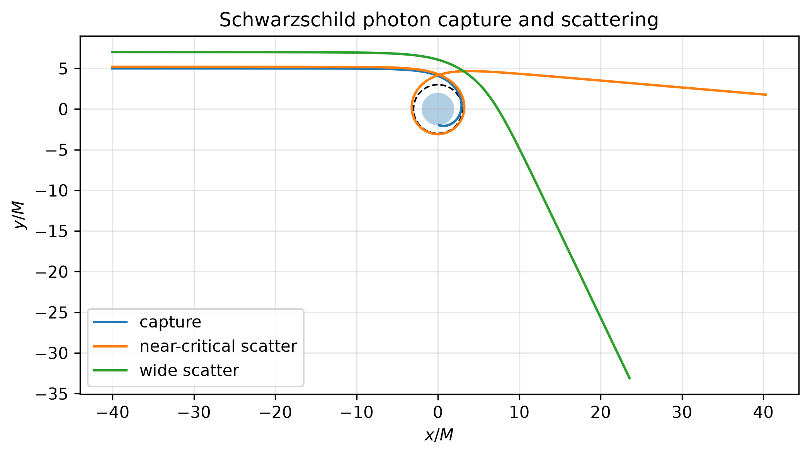
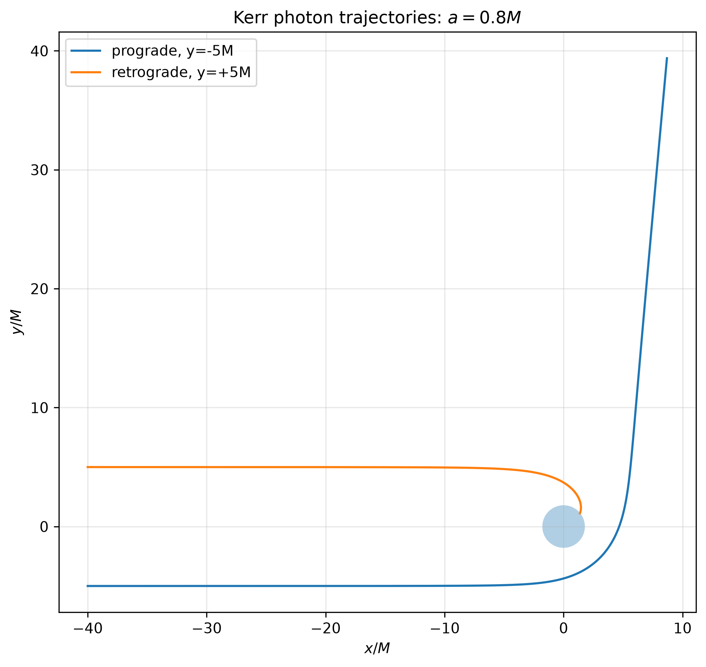
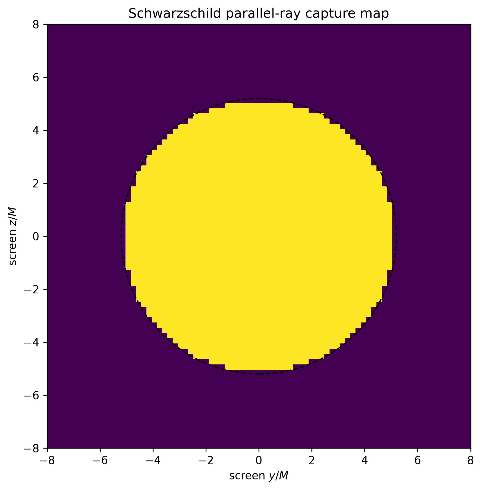
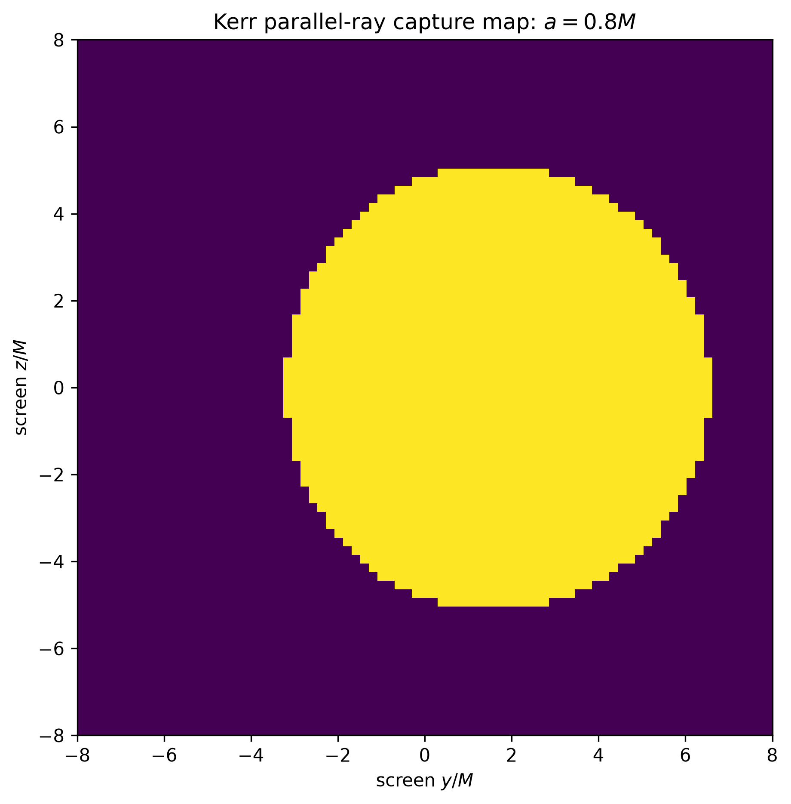

# Kerr–Schild Geodesics

A computational general-relativity project for timelike and null geodesics in Schwarzschild and Kerr spacetimes, written in Cartesian Kerr–Schild coordinates.

The code began as an undergraduate project on particle motion around black holes. The original workflow combined symbolic Python calculations with Fortran integration because direct symbolic evaluation became too slow. The project has since been reconstructed as a reproducible Python package: the geometry is derived symbolically, the geodesic acceleration is reduced to a compact numerical kernel, and the trajectory integration is accelerated with Numba.

The current version includes circular-orbit validation, generic bound motion, frame dragging, photon capture and scattering, and parallel-ray capture maps.

## Selected results

### Bound timelike motion

<p align="center">
  
  
</p>

The Schwarzschild example remains in a fixed orbital plane and shows relativistic apsidal precession. The generic Kerr trajectory is non-equatorial and samples a three-dimensional region because the radial, polar, and azimuthal motions have different characteristic frequencies.

### Photon capture and scattering

<p align="center">
  
  
</p>

In Schwarzschild spacetime the transition between capture and scattering occurs near the familiar critical photon impact parameter,

\[
b_{\rm crit}=3\sqrt{3}\,M.
\]

For Kerr spacetime, equal-magnitude prograde and retrograde offsets do not produce identical outcomes because photon angular momentum couples to the black-hole spin.

### Parallel-ray capture maps

<p align="center">
  
  
</p>

These maps classify initially parallel null rays as captured or escaped. They are capture maps rather than full radiative-transfer images. The Schwarzschild silhouette is nearly circular, while Kerr spin shifts and distorts the capture boundary.

## Geometry and equations of motion

The Kerr metric is written in Kerr–Schild form,

\[
g_{\mu\nu}
=
\eta_{\mu\nu}
+
2H\ell_\mu\ell_\nu,
\]

with metric signature \((-+++)\) and geometrized units \(G=c=1\).

The numerical evolution uses the geodesic equation

\[
\frac{d^2x^\mu}{d\lambda^2}
+
\Gamma^\mu_{\alpha\beta}
\frac{dx^\alpha}{d\lambda}
\frac{dx^\beta}{d\lambda}
=
0.
\]

Rather than simplifying all 64 Christoffel-symbol components separately, the symbolic calculation forms the contracted acceleration directly,

\[
A^\mu
=
-\Gamma^\mu_{\alpha\beta}u^\alpha u^\beta.
\]

This is the quantity required by the integrator. The symbolic expressions are reduced with common-subexpression elimination and converted to numerical Python functions. No SymPy operations occur inside the trajectory integration loop.

Timelike trajectories satisfy

\[
g_{\mu\nu}u^\mu u^\nu=-1,
\]

while photon trajectories satisfy

\[
g_{\mu\nu}k^\mu k^\nu=0.
\]

The Schwarzschild limit is obtained by setting the Kerr spin parameter \(a=0\).

## Numerical strategy

The computational path is

```text
symbolic Kerr–Schild geometry
          ↓
metric derivatives
          ↓
contracted geodesic acceleration
          ↓
common-subexpression elimination
          ↓
Numba-compiled numerical kernel
          ↓
RK4 trajectory integration
```

The reconstructed implementation avoids the symbolic bottleneck that motivated the original Fortran stage.

A representative benchmark on the development machine gave approximately \(0.53\,\mu{\rm s}\) per compiled geodesic right-hand-side evaluation after JIT compilation.

## Validation

The solver is checked against analytic limits, exact circular geodesics, conserved quantities, and an independent SciPy integrator.

| Test | Representative result |
|---|---:|
| Kerr radial quartic identity | exact symbolic zero |
| Kerr–Schild null-vector identity | exact symbolic zero |
| Numerical null-vector residual | \(2.22\times10^{-16}\) |
| Schwarzschild circular orbit: maximum radial drift | \(4.01\times10^{-13}M\) |
| Schwarzschild: maximum normalization drift | \(2.38\times10^{-14}\) |
| Schwarzschild: maximum energy drift | \(1.02\times10^{-14}\) |
| Schwarzschild: maximum \(L_z\) drift | \(1.47\times10^{-14}\) |
| RK4 vs. SciPy DOP853 final-state difference | \(4.47\times10^{-10}\) |
| Kerr \(a=0.5M\), prograde circular orbit: radial drift | \(3.46\times10^{-13}M\) |
| Kerr \(a=0.5M\), retrograde circular orbit: radial drift | \(4.39\times10^{-13}M\) |

The automated test suite currently contains ten tests covering metric limits, circular timelike motion, frame dragging, null normalization, photon capture/scattering, and Kerr prograde/retrograde capture asymmetry.

Small floating-point differences between systems are expected.

## Frame dragging

For a zero-angular-momentum observer,

\[
\Omega_{\rm ZAMO}
=
-\frac{g_{t\phi}}{g_{\phi\phi}}.
\]

For \(a=0.5M\), the numerical values from the validation notebook are approximately

| Radius | \(\Omega_{\rm ZAMO}M\) |
|---|---:|
| \(10M\) | \(9.97\times10^{-4}\) |
| \(5M\) | \(7.89\times10^{-3}\) |
| \(3M\) | \(3.54\times10^{-2}\) |

The increase toward the black hole provides a direct numerical illustration of rotational frame dragging.

## Repository structure

```text
kerr-schild-geodesics/
├── src/
│   └── kerr_schild_geodesics/
│       ├── __init__.py
│       ├── integrators.py
│       ├── kerr_schild.py
│       ├── null_geodesics.py
│       └── orbits.py
├── notebooks/
│   ├── 00_environment_and_performance.ipynb
│   ├── 01_kerr_schild_geometry.ipynb
│   ├── 02_geodesic_rhs.ipynb
│   ├── 03_rk4_and_validation.ipynb
│   ├── 04_exact_kerr_circular_orbits.ipynb
│   ├── 05_generic_bound_kerr_orbit.ipynb
│   ├── 06_bound_schwarzschild_orbit.ipynb
│   └── 07_null_geodesics_capture_scattering.ipynb
├── tests/
│   ├── test_physics.py
│   └── test_null_geodesics.py
├── figures/
├── references.bib
├── CITATION.cff
├── LICENSE
├── pyproject.toml
└── README.md
```

## Installation

Python 3.13 was used for the validated development environment.

```bash
python3 -m venv .venv
source .venv/bin/activate
python -m pip install --upgrade pip
python -m pip install -e ".[research,dev]"
```

The automated checks can be run with

```bash
pytest -v
```

and the notebooks can be opened with

```bash
jupyter lab
```

## Notebook sequence

`00_environment_and_performance.ipynb` records the numerical workflow and performance choices.

`01_kerr_schild_geometry.ipynb` constructs the Kerr radial coordinate, Kerr–Schild null one-form, metric, inverse metric, and Schwarzschild/Minkowski limits.

`02_geodesic_rhs.ipynb` derives the contracted geodesic acceleration while avoiding expansion of unnecessary symbolic expressions.

`03_rk4_and_validation.ipynb` validates the numerical kernel with an exact Schwarzschild circular orbit and an independent SciPy DOP853 integration.

`04_exact_kerr_circular_orbits.ipynb` studies exact prograde and retrograde equatorial Kerr circular geodesics and the ZAMO frame-dragging angular velocity.

`05_generic_bound_kerr_orbit.ipynb` evolves a generic non-equatorial bound Kerr geodesic and produces a three-dimensional animation.

`06_bound_schwarzschild_orbit.ipynb` provides a comparable bound Schwarzschild example in a fixed orbital plane.

`07_null_geodesics_capture_scattering.ipynb` extends the same geodesic engine to photons, including capture, scattering, spin asymmetry, and finite-distance parallel-ray capture maps.

## Scope and limitations

The trajectories are test-particle geodesics. Radiation reaction, gravitational-wave backreaction, hydrodynamics, magnetic fields, and self-force effects are not included.

The photon capture maps classify null rays by their dynamical fate. They should not be interpreted as synthetic telescope images or full black-hole ray-tracing calculations with radiative transfer.

The project is intended as a computational general-relativity study and as a reproducible reconstruction of earlier undergraduate work.

## References

The implementation and validation were guided by standard results for the Kerr spacetime and geodesic motion:

1. R. P. Kerr, “Gravitational Field of a Spinning Mass as an Example of Algebraically Special Metrics,” *Physical Review Letters* **11**, 237 (1963). DOI: 10.1103/PhysRevLett.11.237.
2. B. Carter, “Global Structure of the Kerr Family of Gravitational Fields,” *Physical Review* **174**, 1559 (1968). DOI: 10.1103/PhysRev.174.1559.
3. J. M. Bardeen, W. H. Press, and S. A. Teukolsky, “Rotating Black Holes: Locally Nonrotating Frames, Energy Extraction, and Scalar Synchrotron Radiation,” *The Astrophysical Journal* **178**, 347 (1972).
4. S. Chandrasekhar, *The Mathematical Theory of Black Holes*, Oxford University Press (1983).
5. E. Teo, “Spherical Photon Orbits Around a Kerr Black Hole,” *General Relativity and Gravitation* **35**, 1909–1926 (2003). DOI: 10.1023/A:1026286607562.

A BibTeX file is included in `references.bib`.

## License

Released under the MIT License. See `LICENSE`.

## Project background

The first version of this project was developed during undergraduate research on particle trajectories around black holes. Symbolic calculations were originally performed in Python and the numerical Runge–Kutta stage was moved to Fortran because direct symbolic evaluation was too slow.

The present reconstruction retains the symbolic derivation but replaces the old numerical workflow with a compact Python package, Numba-accelerated integration, automated validation, and both timelike and null trajectory calculations.
